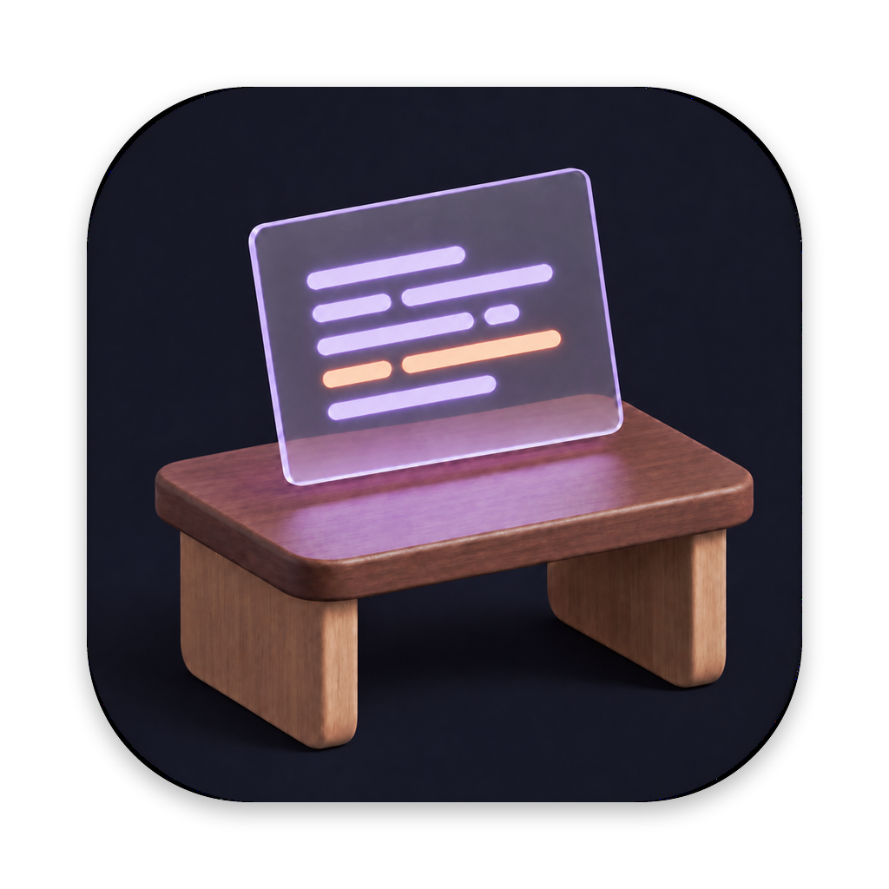

# Atelier



**An editor, a shell, and Claude Code. One native macOS workspace.**

Atelier keeps your code and your agent in view, with a workspace for each
project and session. Move between branches, follow what your agents are doing,
and pick up your conversations when you return.

Built with AppKit, with a keyboard-first workflow, Catppuccin Mocha colors,
and native translucency. Claude Code runs as its own process, with its tools
and permissions intact.

Atelier is the author's daily driver. Version **1.4.4** is available in the
source history; the instructions below build the app locally.

## A place to work

- **Code, shell, and agent together.** A focused three-pane layout, with
  projects across the top and sessions along the bottom. Session titles follow
  Claude's conversation summaries, or you can name them yourself.
- **An editor with familiar controls.** Syntax highlighting, a file explorer,
  file and text search, multiple cursors, Markdown preview, and optional
  autosave. Installed language servers add navigation and diagnostics.
- **Workspaces for your branches.** Choose or create a Git worktree when
  starting a session. Sessions group by worktree, and the optional `atelier`
  command brings the same workflow to your shell.
- **Copy you can use.** Agent selections use Claude's saved transcript to
  recover Markdown without terminal wrapping and gutter indentation.
- **Know when to come back.** Claude's hooks, wired in by Atelier, update session indicators
  and the Dock badge. Click a notification to return to its session.
- **Continue where you left off.** Atelier restores projects and sessions on
  relaunch and resumes Claude conversations. Remote shell and agent sessions
  run inside tmux on the host and can reconnect after a dropped connection.

Atelier grew out of a personal Ghostty, tmux, Helix, and Claude Code setup.
It keeps that workflow in a deliberately small native app. It is opinionated
about its layout and scope; there is no plugin marketplace or arbitrary pane
system. If this way of working suits you, you are welcome here.

## Build and run

The current bundle script targets **Apple Silicon Macs running macOS 14 or
later**. You will need a Swift 6 toolchain, Xcode command-line tools, Git, and
[Claude Code](https://claude.com/claude-code) installed and authenticated.
Check that `claude` works in your terminal before launching Atelier.

From the repository root:

```sh
make run
```

This builds the app, assembles `.build/Atelier.app`, and launches it. The first
build downloads Swift package dependencies. Open a project from the landing
screen to start working.

To make the app available in Applications, Spotlight, and the Dock:

```sh
make install
```

This creates a symlink to the build in this checkout, rather than copying the
app. Keep the checkout in place. See the [setup guide](docs/SETUP.md) for
notifications and sounds, the optional CLI, language servers, and remote sessions.

Local builds use ad-hoc signing or a local development certificate. Release
zips (`make release`, the build the Homebrew cask ships) are Developer
ID-signed and notarized; the setup guide covers the one-time setup.

## A few useful shortcuts

| Action | Shortcut |
| --- | --- |
| Command palette | ⇧⌘P |
| Go to file | ⌘P |
| Find in project | ⇧⌘F |
| Explorer search | ⇧⌘E |
| Show or hide explorer | ⌘B |
| New project | ⌘T |
| New session | ⌥⌘T |
| Reopen closed session | ⇧⌘T |
| Close project (reopen it to get its sessions back) | ⌥⌘W |
| Close project and end its sessions | ⇧⌥⌘W |
| Switch layout | ⌘\ |
| Settings | ⌘, |

Worktree selection and autosave can be enabled in Settings. Both are off by
default. Remote sessions use the shell/agent layout; the local editor and
worktree tools are not available there.

## Help shape Atelier

Useful bug reports, documentation improvements, and focused fixes are welcome.
For larger changes, start with the workflow you want to improve so we can
agree on the scope before you invest in an implementation.

Read [CONTRIBUTING.md](CONTRIBUTING.md) for setup, verification, and what to
include in an issue or pull request. This is a personal project; response times
and feature requests are handled as time allows.

## Under the hood

Atelier uses [SwiftTerm](Vendor/SwiftTerm) for terminals and the
[CodeEdit packages](Vendor/CodeEditSourceEditor) for its editor, with tree-sitter
syntax highlighting and the Catppuccin palette. Vendored changes are recorded
in the packages' `ATELIER.md` files; dependency licenses remain with their sources.

- [Vision](VISION.md): the workflow and design principles.
- [Technical plan](TECHNICAL_PLAN.md): architecture and development history.
- [Design rules](docs/POLISH_PLAN.md): typography, surfaces, and interaction.
- [Development log](docs/devlog/): implementation notes and tradeoffs.
- [Release checklist](docs/RELEASING.md): preparing a public release.

## License

Atelier's original code is available under the [MIT License](LICENSE). Vendored
libraries and other third-party components retain their own licenses and notices.
